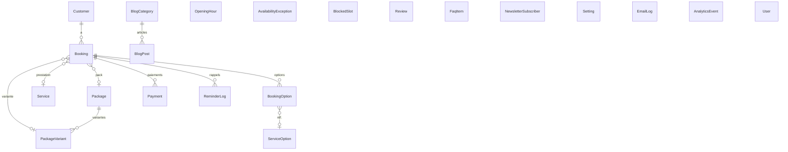

# Architecture

```
Navigateur (mobile-first)
   │  Next.js 14 (App Router, React 18, Tailwind)
   ▼
Pages publiques (SSR)  ·  Tunnel de réservation (client)  ·  Admin (server actions)
   │                                   │
   └──────────── API routes ───────────┘   /api/availability, /api/booking/*, /api/webhooks/*, /api/cron/*
                        │
          src/lib : pricing · availability · booking · payments · email · auth · upload
                        │
              Prisma ORM ──► SQLite (dev) / PostgreSQL (prod)
                        │
   Prestataire de paiement ──webhook signé──► /api/webhooks/…   ──► booking CONFIRMED ──► email
```

| Couche | Technologie |
|---|---|
| Frontend | Next.js 14, React 18, Tailwind CSS (Cormorant Garamond + Jost) |
| Backend | Route handlers + server actions Next.js, Zod |
| Base de données | Prisma — SQLite en local, PostgreSQL recommandé en production |
| Paiement | Interface `PaymentProvider` : `mock` (démo) et `stripe` (Checkout + webhook) |
| Email | nodemailer (SMTP) ou journal en base |
| Images | sharp (validation, redimensionnement, WebP) |

## Schéma de base de données



Notes : `Booking` stocke un **instantané** (nom, variante, prix, acompte) pour que l'historique ne change pas si le catalogue change. Les dates sont des chaînes `YYYY-MM-DD` + minutes depuis minuit dans le fuseau de l'entreprise (réglage `timezone`).

## États d'une réservation

```
PENDING_PAYMENT ──paiement confirmé (webhook)──► CONFIRMED ──► COMPLETED
      │                                            │  └──► NO_SHOW
      ├─ verrou expiré ─► EXPIRED                  └──► CANCELLED
      └─ paiement tardif sur créneau repris ─► CONFLICT (à traiter : déplacer / rembourser)
```
Paiement : `PENDING → PAID | FAILED → REFUNDED`.

## User flow

```
Accueil ─► Réservation ─► Catégorie (Packs | Prestations) ─► Produit ─► Variante (packs)
   ─► Options (si applicables) ─► Date/heure ─► Coordonnées ─► [booking PENDING_PAYMENT + verrou]
   ─► Récapitulatif + paiement ─► Prestataire ─► webhook ─► CONFIRMED + email
   ─► « Une dernière étape » (preuve Instagram) ─► Confirmation
```
Chaque étape vérifie les précédentes (redirection si une étape obligatoire est sautée) ; le serveur revalide tout au checkout et au paiement.

## Règles métier configurables (admin → Paramètres)

Fuseau, intervalle des créneaux, durée du verrou, horizon de réservation, préavis, rappels, délai d'annulation en ligne, textes de politique (remboursement, déplacement, réservation), coordonnées. **Aucune règle commerciale d'annulation n'est inventée** : tant que le délai n'est pas renseigné, la cliente est invitée à contacter l'entreprise.
